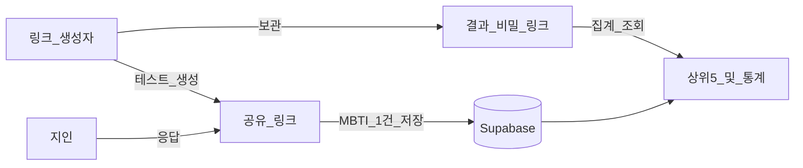

# 남BTI ✍🏻

남이 보는 내 MBTI — 주변 사람들이 나를 어떤 유형으로 보는지 모아 보는 테스트.

---

## 배포 주소

[mbti-by-others.vercel.app](https://mbti-by-others.vercel.app)

---

## 기술 스택

| 구분 | 기술 |
|------|------|
| 프레임워크 | Next.js 16 (App Router) · React 19 · TypeScript |
| 스타일 | Tailwind CSS 4 · Pretendard · Dongle · Syne |
| 상태/저장 | **Supabase** (Postgres) · 로컬/배포 동일 |
| 유틸 | nanoid (링크 ID) · html-to-image (결과 PNG 저장) |
| 배포 | Vercel + Supabase 환경변수 |

---

## 기능

- 이름 입력 후 **공유 링크**(`/t/...`) · **결과 비밀 링크**(`/r/...`) 발급
- 지인이 **나에 대해** 60문항 응답 (7점 척도, 이름+은/는 조사 자동)
- 응답자 **닉네임 선택 입력** (미입력 시 `(익명)`), 동일인 여러 번 제출 가능
- MBTI 4축(E/I, S/N, T/F, J/P) 채점 후 유형 산출
- 결과 보드: 최신/최다 유형, **TOP 5**, 비율(%), 응답 수, 최근 응답 목록
- 결과 카드 **이미지 저장** (카드 안 남BTI 로고 포함)
- 페이지 이동(다음/이전) 시 **상단 스크롤**

---

## UI · 반응형

- 홈·입력 영역: `max-w-md` 콘텐츠 폭
- 테스트 문항(PC): 페이지 전체 폭(`max-w-3xl`) 사용, 척도 **그렇다 ↔ 체크 ↔ 그렇지 않다** 양끝 배치
- 결과(PC): 결과 카드 · **Recent** **2열** / 모바일은 세로 스택
- 모바일: 브랜드·타이틀 크기 확대, 척도 간격·터치 영역 조정

---

## 서비스가 하는 일 (핵심 플로우)



1. **나**가 이름을 넣고 테스트 생성
2. **공유 링크** (`/t/...`) → 지인에게 보냄
3. 지인이 **닉네임을 남긴 뒤**(선택, 비우면 `(익명)`), 60문항을 **나에 대해** 답함  
   - 문항 예: `지혜는 새로운 친구를 꾸준히 만드는 편이다.`
4. 그 응답으로 MBTI 1개가 산출·저장됨 (같은 사람도 여러 번 제출 가능)
5. **결과 비밀 링크** (`/r/...`) → 나만 열람
6. 결과 화면: 방금/최다 **MBTI** + **상위 5개** + 응답 수·유형별 **%** + 이미지 저장 + 최근 응답 목록

로그인 없이, 생성 시 **공유 링크**와 **결과 전용 비밀 링크** 두 개를 받습니다. 결과 링크를 잃어버리면 복구하기 어려우니 따로 보관하세요.

---

## 흐름 (요약)

1. 이름 입력 → 테스트 링크 생성
2. **Share** 링크를 친구에게 공유
3. **Private** 결과 링크로 TOP 5 · 비율 확인
4. 응답자: 닉네임 입력(선택) → 60문항 → 결과 통계에 합산

---

## 파일 구조

```text
mbti-by-others/
├── data/
│   └── .gitkeep              # (레거시) 로컬 파일 저장용, 현재는 Supabase 사용
├── public/                   # 정적 에셋
├── src/
│   ├── app/
│   │   ├── page.tsx          # 홈 · 링크 생성 (max-w-3xl)
│   │   ├── layout.tsx
│   │   ├── globals.css
│   │   ├── not-found.tsx
│   │   ├── t/[slug]/page.tsx # 지인 테스트 (닉네임 → 퀴즈)
│   │   ├── r/[token]/page.tsx# 결과 · 통계 (PC 2열)
│   │   └── api/
│   │       ├── tests/                  # 테스트 생성 · 조회
│   │       ├── tests/[slug]/responses/ # 응답 제출
│   │       └── results/[token]/       # 결과 집계
│   ├── components/           # UI (CreateForm, TestForm, ResultView …)
│   ├── data/questions.ts     # 60문항 + 축 매핑
│   └── lib/                  # josa · scoring · store · supabase
├── .env.example              # 환경변수 예시
├── questions-ko.json         # 재작성 문항 원본
└── package.json
```