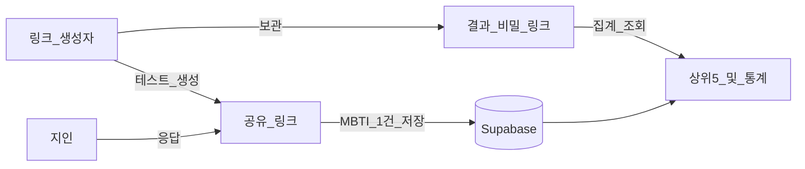

# 남BTI

남이 보는 내 MBTI — 주변 사람들이 나를 어떤 유형으로 보는지 모아 보는 테스트.

## 실행

```bash
npm install
npm run dev
```

[http://localhost:3000](http://localhost:3000)

## 서비스가 하는 일 (핵심 플로우)



1. **나**가 이름을 넣고 테스트 생성
2. **공유 링크** (`/t/...`) → 지인에게 보냄
3. 지인이 닉네임(선택, 미입력 시 `(익명)`)을 적고, 60문항을 **나에 대해** 답함  
   - 문항 예: `지혜는 새로운 친구를 꾸준히 만드는 편이다.`
4. 그 응답으로 MBTI 1개가 산출·저장됨 (같은 사람도 여러 번 제출 가능)
5. **결과 비밀 링크** (`/r/...`) → 나만 열람 (헤더의 작은 로고는 유지)
6. 결과 화면: 방금/최다 **MBTI** + **상위 5개** + 응답 수·유형별 **%** + 이미지 저장 + 최근 응답 목록

로그인 없이, 생성 시 **공유 링크**와 **결과 전용 비밀 링크** 두 개를 받습니다. 결과 링크를 잃어버리면 복구하기 어려우니 따로 보관하세요.

## 흐름 (요약)

1. 이름 입력 → 테스트 링크 생성
2. **Share** 링크를 친구에게 공유
3. **Private** 결과 링크로 TOP 5 · 비율 확인
4. 응답자는 닉네임 선택(미입력 시 `(익명)`), 여러 번 제출 가능

## 데이터

로컬: `data/store.json`  
배포 시에는 DB(Supabase 등) 연동이 필요합니다.
